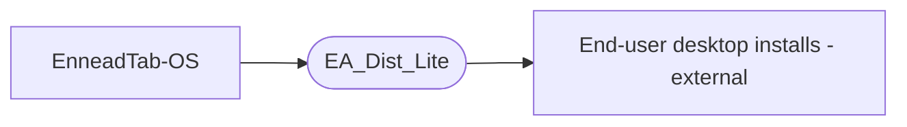

# ORGANIZATION-RELATIONSHIP

<!-- org-relationship v1 · ecosystem: enneadtab · maintained by senzhang-plugin-hub:sen-ennead-relationship-map -->

## Identity

- **Repo:** EA_Dist_Lite
- **Role:** Auto-generated LITE distribution channel / installer feed — a size-stripped mirror of the EnneadTab desktop distribution (installers + pyRevit/Rhino/CAD tool scripts + integrity manifests). Not manually maintained.

## Upstream (this repo consumes)

| Service (repo) | Interface consumed | What flows | If it changes → do this here |
|---|---|---|---|
| EnneadTab-OS | Build/generation pipeline — this repo is automatically generated from OS's source tree (`Apps/_revit/EnneaDuck.extension/…`, installers) | The bundled tool scripts, installer executables (`EnneadTab_OS_Installer.exe`, `EnneadTab_For_Revit_Installer.exe`, etc.), and `dist_manifest.json` / `exe_hash.json` hashes | This repo is regenerated, not hand-edited — change the source/build in EnneadTab-OS, then re-run the distribution generator; do not hand-edit `Apps/`/`Installation/`. |

## Downstream (consumes this repo)

| Service (repo) | Interface provided | What flows | If THIS repo changes → go update |
|---|---|---|---|
| End-user desktop installs (external) | Direct download of installer `.exe`s + `enneadtab-doctor.bat`; `dist_manifest.json` + `exe_hash.json` integrity check/repair | Installers and the file-hash manifest the on-machine EnneadTab-OS auto-updater / doctor verify against | If the manifest schema, file layout, or installer names change, update the on-machine EnneadTab-OS auto-updater + `enneadtab-doctor.bat` that read this feed. |

## Flow

Last verified: 2026-08-07
